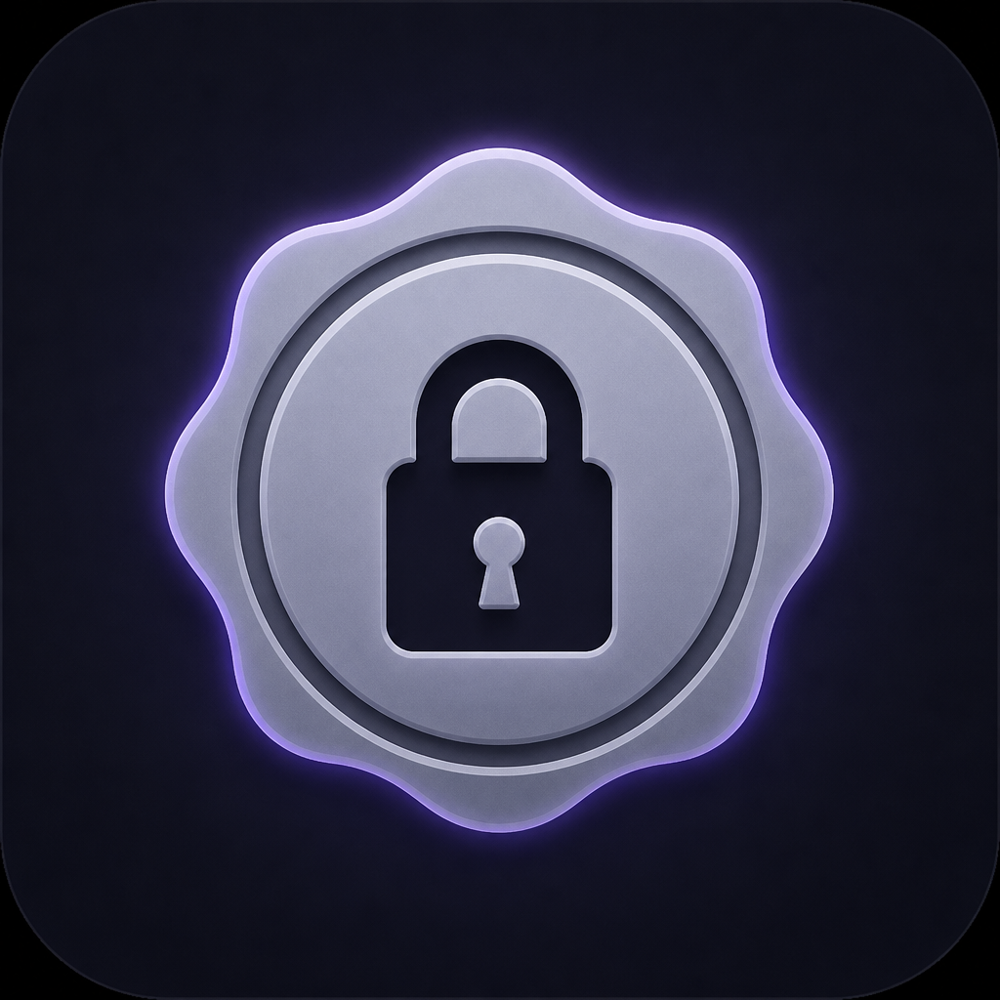

<p align="center">
  
</p>

<h1 align="center">Sealed</h1>

<p align="center">
  <strong>Local-first encrypted secrets manager for developers</strong><br />
  Store secrets once. Inject them into any project — without committing them to git.
</p>

<p align="center">
  <a href="https://github.com/Myrafy/sealed/releases/latest"></a>
  <a href="LICENSE"></a>
  <a href="https://github.com/Myrafy/sealed/actions/workflows/release.yml"></a>
  
</p>

<p align="center">
  <a href="https://myrafy.com">Website</a> ·
  <a href="https://github.com/Myrafy/sealed/releases/latest">Download</a> ·
  <a href="#security">Security</a> ·
  <a href="CONTRIBUTING.md">Contributing</a> ·
  <a href="https://github.com/Myrafy/sealed/issues">Issues</a>
</p>

---

## Why Sealed

Most teams end up with secrets scattered across Slack, `.env` files, and personal notes. Sealed keeps them in an **encrypted vault on your machine**, grouped by app, and writes the right env file into each project folder — git-ignored automatically.

- **Local-first** — master password and encryption keys never leave your device
- **Zero code changes** — inject `.env` or .NET `launchSettings.json`
- **Optional sync** — store ciphertext in MongoDB when you need multiple machines

## Features

| Capability | Description |
|------------|-------------|
| **Encrypted vault** | AES-256-GCM with scrypt key derivation |
| **Per-app isolation** | Group secrets by project; each app has its own vault |
| **Auto-inject** | Link a folder; Sealed writes and syncs env files |
| **Storage backends** | Local encrypted file (default) or MongoDB (ciphertext only) |
| **Cross-platform** | macOS (DMG), Windows (NSIS), Linux (AppImage / deb) |

## Quick start

### 1. Install

Download the latest build from **[GitHub Releases](https://github.com/Myrafy/sealed/releases/latest)**:

| Platform | Artifact |
|----------|----------|
| macOS Apple Silicon | `Sealed-*-mac-arm64.dmg` |
| macOS Intel | `Sealed-*-mac-x64.dmg` |
| Windows | `Sealed-*-win-x64.exe` |
| Linux | `Sealed-*-linux-x64.AppImage` or `.deb` |

> **macOS:** Builds are notarized when Apple signing is configured ([docs](docs/macos-signing.md)). Until then, right-click the app → **Open** on first launch.

### 2. First run

1. Create a strong **master password** — there is no recovery if it is lost.
2. Optionally add a MongoDB URI for cross-machine sync, or skip for local-only storage.
3. Create an **App**, then add your secrets.

### 3. Link a project

1. Open an App → **Link project**.
2. Choose the injection format:
   - **`.env`** — Node.js, Next.js, Express, and most runtimes
   - **`launchSettings.json`** — .NET Core (`dotnet run` / Visual Studio)
3. Select the project folder. Sealed writes the file and keeps it in sync, and adds it to `.gitignore` when needed.

## Using secrets in your projects

### Node.js / Next.js

Next.js loads `.env` automatically. Elsewhere, use `process.env` (or `dotenv` if you prefer):

```js
const url = process.env.DATABASE_URL
```

```js
require('dotenv').config() // optional for non-Next apps
const port = process.env.PORT
```

### .NET

**Option A — DotNetEnv**

```bash
dotnet add package DotNetEnv
```

```csharp
DotNetEnv.Env.Load();
var connStr = Environment.GetEnvironmentVariable("DATABASE_URL");
```

**Option B — launchSettings.json**

Link the project with the **launchSettings.json** format. Sealed merges secrets into `Properties/launchSettings.json` so Visual Studio and `dotnet run` pick them up with no code changes.

## Security

Sealed is designed so plaintext secrets stay off the network and out of the UI by default.

| Control | Behavior |
|---------|----------|
| Key material | Master key lives only in the Electron **main process** memory |
| Renderer isolation | Secret values reach the UI only on explicit **Reveal** or **Copy** |
| At rest | AES-256-GCM; unique random IV per secret value |
| Password check | Verifier-based unlock — wrong password fails closed |
| MongoDB backend | Stores **ciphertext + IV + auth tag** only; URI via Electron `safeStorage` |
| Project files | Linked `.env` / `launchSettings.json` are added to `.gitignore` |

**Responsible disclosure:** report vulnerabilities privately to [hello@myrafy.com](mailto:hello@myrafy.com). Do not open a public issue for undisclosed security problems.

## Architecture

```
src/
  main/           # Electron main: crypto, storage, sync, IPC
    crypto/       # scrypt KDF, AES-256-GCM
    storage/      # file + Mongo providers
    sync/         # .env / launchSettings writers, gitignore helpers
  preload/        # contextBridge (window.api)
  renderer/       # React UI
shared/           # IPC contracts and shared types
```

Stack: Electron · electron-vite · React · TypeScript · Zustand · Vitest

## Development

**Requirements:** Node.js 20+ (recommended), npm

```bash
git clone https://github.com/Myrafy/sealed.git
cd sealed
npm install
npm run dev       # development app
npm test          # unit tests
npm run typecheck
```

| Script | Purpose |
|--------|---------|
| `npm run build:mac` | macOS DMG |
| `npm run build:win` | Windows installer |
| `npm run build:linux` | Linux AppImage / deb |
| `npm run electron:install` | Repair Electron binary download |

Common issues (Gatekeeper, Electron install, `ELECTRON_RUN_AS_NODE`) are covered in [docs/troubleshooting.md](docs/troubleshooting.md).

## Contributing

We welcome issues and pull requests.

1. Read [CONTRIBUTING.md](CONTRIBUTING.md) — PRs target **`develop`**, not `main`.
2. Branch from the latest `develop`, open a PR, and wait for maintainer review.
3. Releases are cut by maintainers: `develop` → `main` → version tag (`v*`) → GitHub Actions publishes installers.

## Roadmap

- [ ] Local agent + language SDKs for zero-file injection
- [ ] Multiple environments (dev / staging / prod) per App
- [ ] Team secret sharing
- [ ] CLI (`sealed sync`, `sealed add`)
- [ ] Broader language support (Python, Go, Ruby)

## Support

- **Bugs & features:** [GitHub Issues](https://github.com/Myrafy/sealed/issues)
- **Product / company:** [myrafy.com](https://myrafy.com) · [hello@myrafy.com](mailto:hello@myrafy.com)

## License

[MIT](LICENSE) © [Myrafy](https://myrafy.com)
